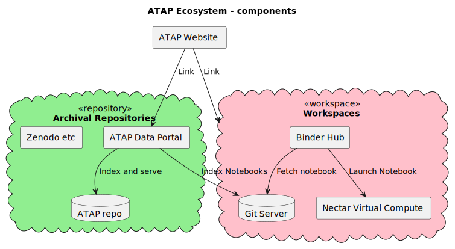

# plantuml-diagrams
A place to put (and generate) plantuml diagrams

ATAP Ecosystem Components


## How to generate diagrams using the Command Line (Homebrew)

Using Homebrew (Recommended)
	1.	Install Java (if not already installed):
    `brew install openjdk`
	2.	Install PlantUML:
    `brew install plantuml`

Generate an SVG file by running:

```sh
plantuml -tsvg diagram.puml
```

This will create diagram.svg in the same directory.