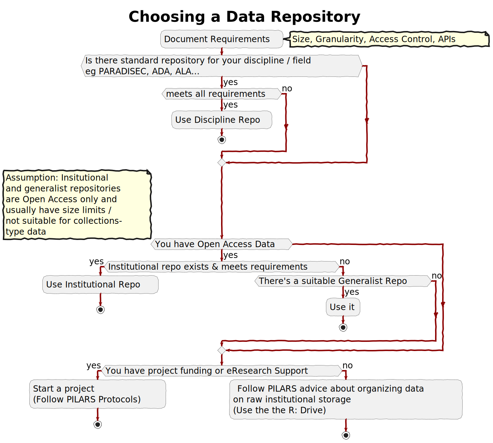
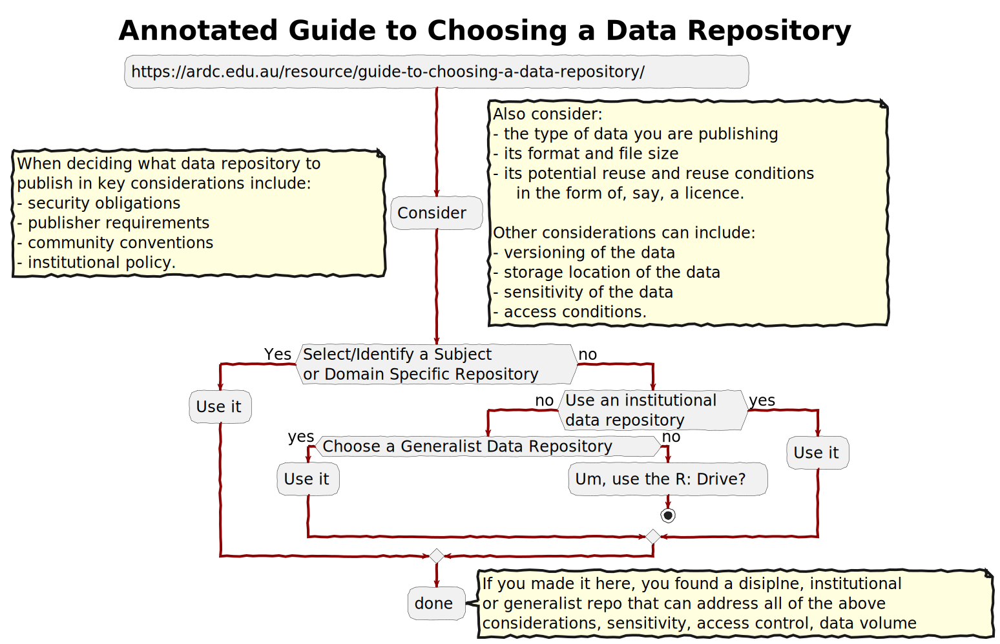
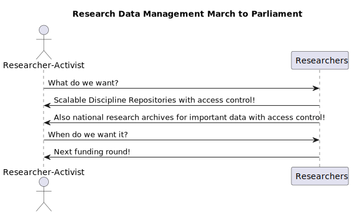
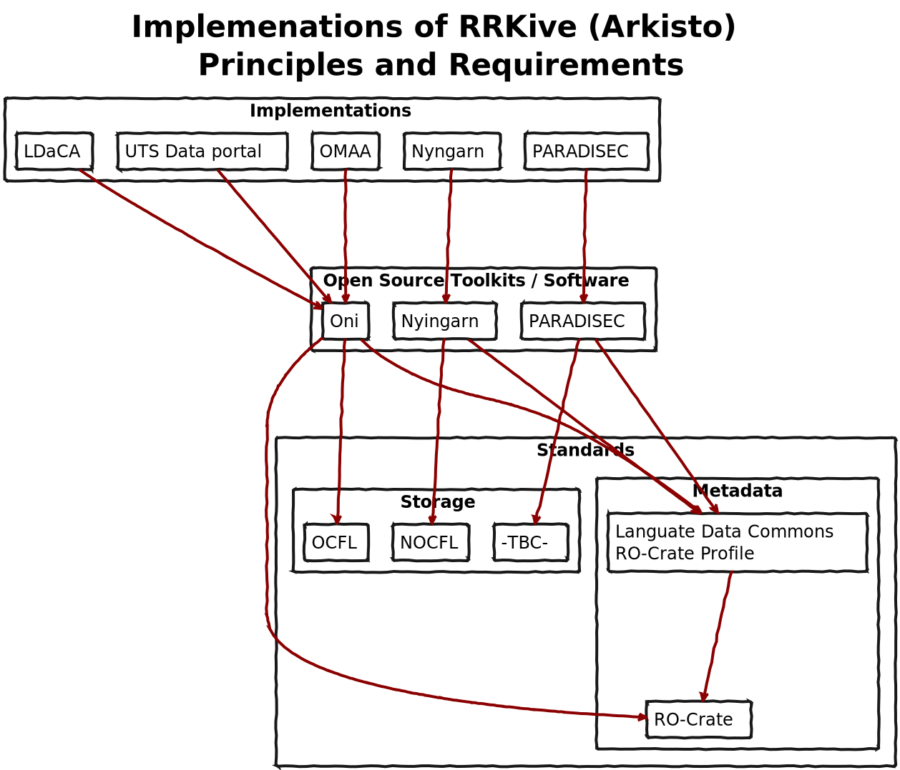
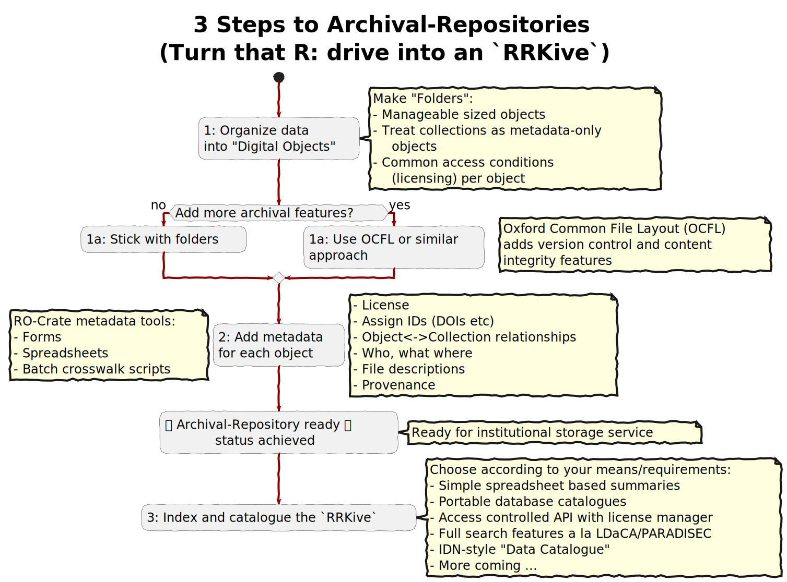

# Image summary for arkisto

## [arkisto/ardc-repo-chooser-2.svg](./ardc-repo-chooser-2.svg)

## [arkisto/ardc-repo-chooser-full.svg](./ardc-repo-chooser-full.svg)

## [arkisto/ardc-repo-chooser.svg](./ardc-repo-chooser.svg)

## [arkisto/building-on-rrkive-storage.svg](./building-on-rrkive-storage.svg)

## [arkisto/choosing-a-repo.svg](./choosing-a-repo.svg)

## [arkisto/is-it-a-repository.svg](./is-it-a-repository.svg)

## [arkisto/pre-steps-to-archival-repositories.svg](./pre-steps-to-archival-repositories.svg)

## [arkisto/repo-activism.svg](./repo-activism.svg)

## [arkisto/research-work-cycle-simple.svg](./research-work-cycle-simple.svg)

## [arkisto/research-work-cycle.svg](./research-work-cycle.svg)

## [arkisto/ro-crate-layers copy.svg](./ro-crate-layers copy.svg)

## [arkisto/ro-crate-layers.svg](./ro-crate-layers.svg)

## [arkisto/rrkive-implementations.svg](./rrkive-implementations.svg)

## [arkisto/steps-to-archival-repositories.svg](./steps-to-archival-repositories.svg)

