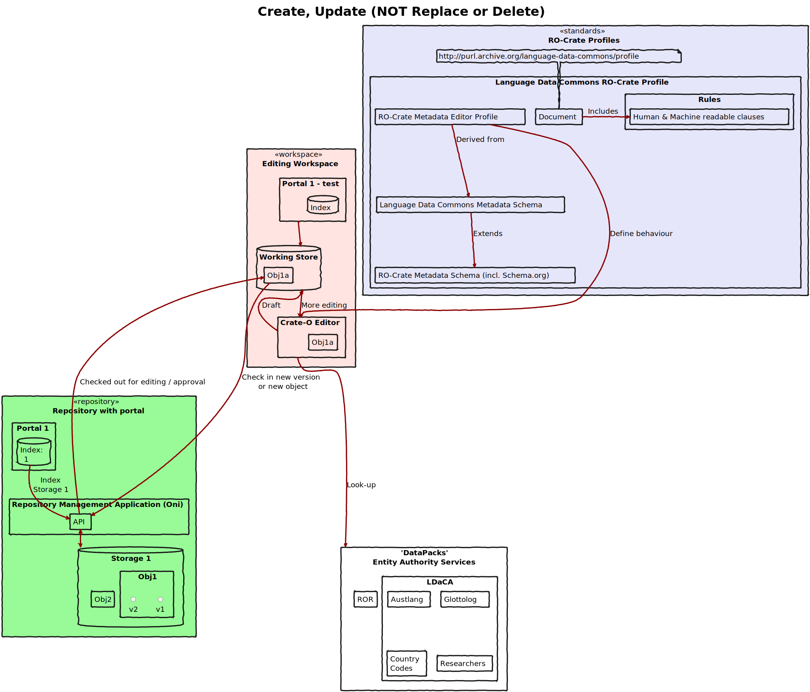

# Image summary for crate-o

## [crate-o/crud-objects.svg](./crud-objects.svg)

## [crate-o/dynamic-data-packs.svg](./dynamic-data-packs.svg)

## [crate-o/ro-crate-plus-editor-profiles.svg](./ro-crate-plus-editor-profiles.svg)

## [crate-o/simple-object-upload.svg](./simple-object-upload.svg)

