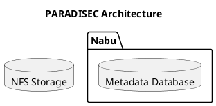

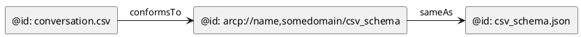

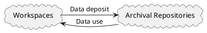

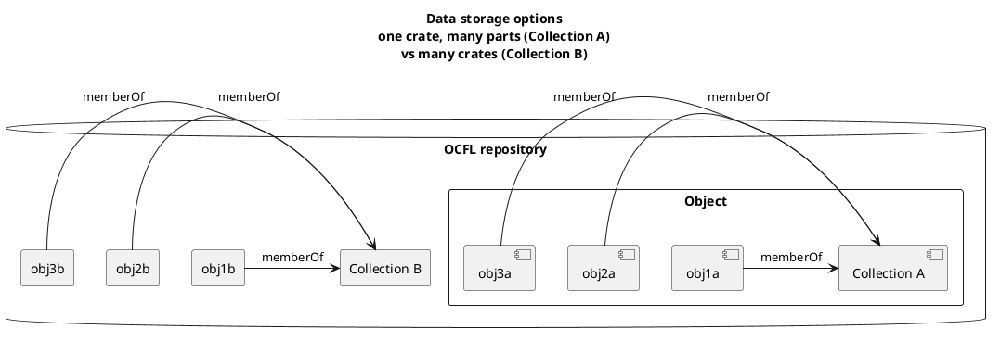


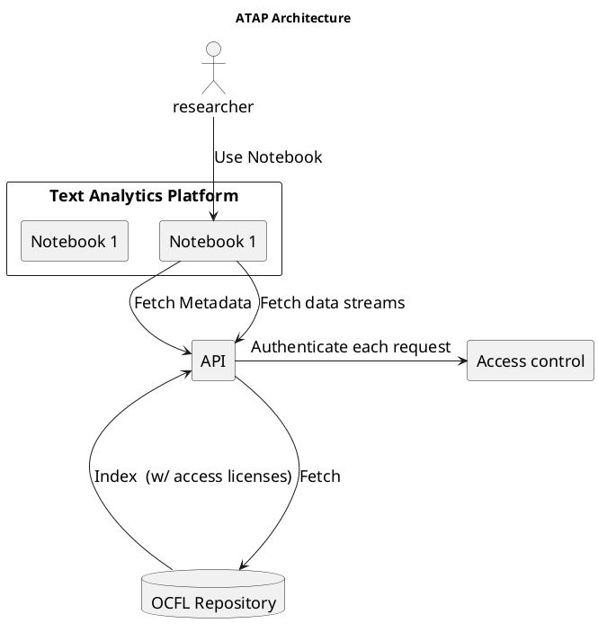

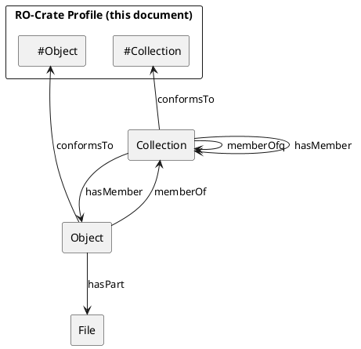


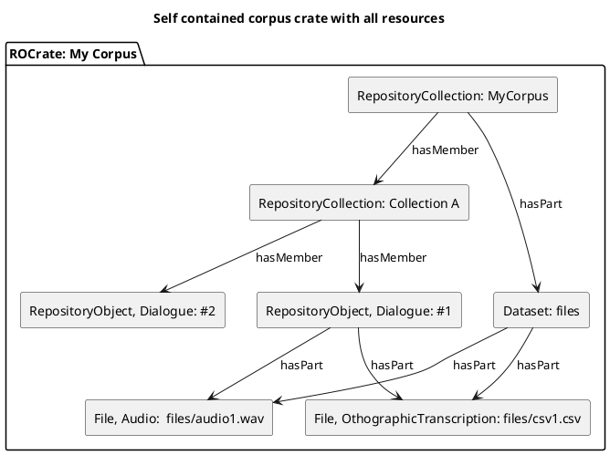

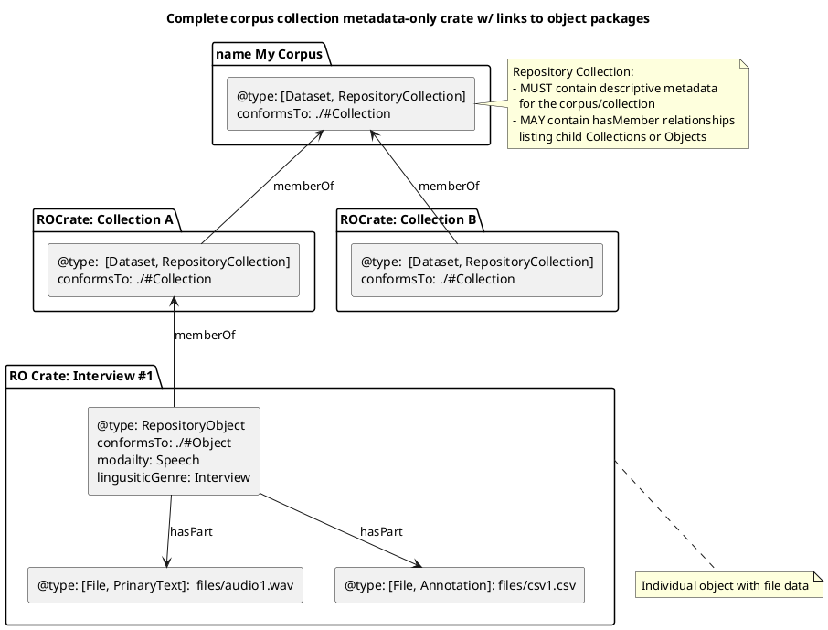

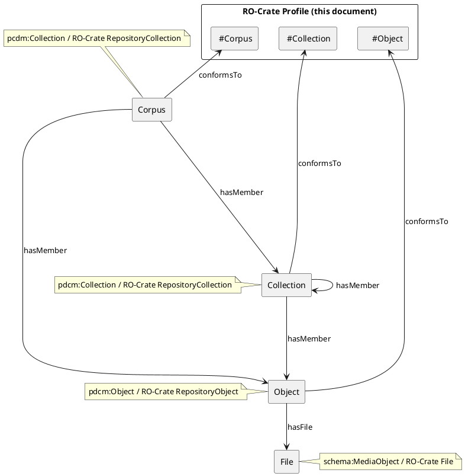

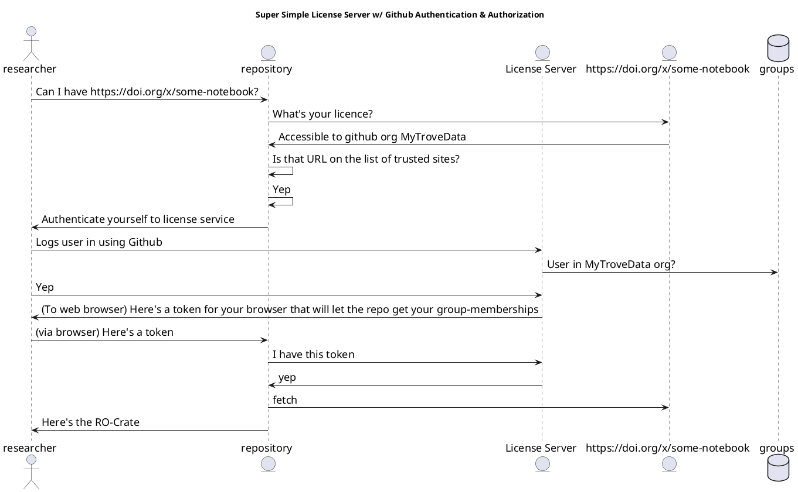
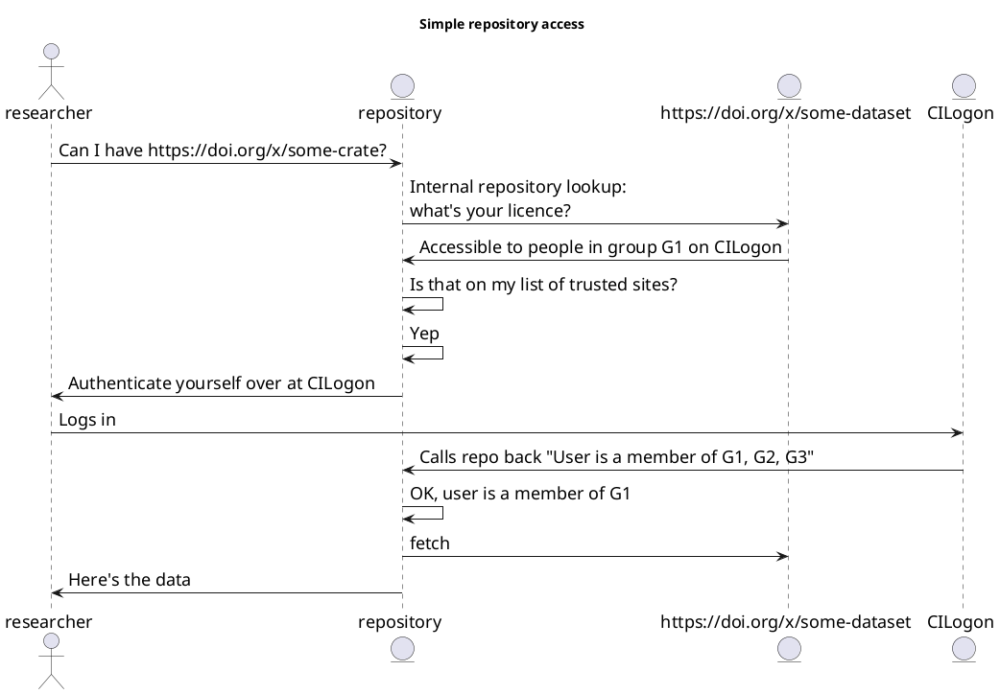

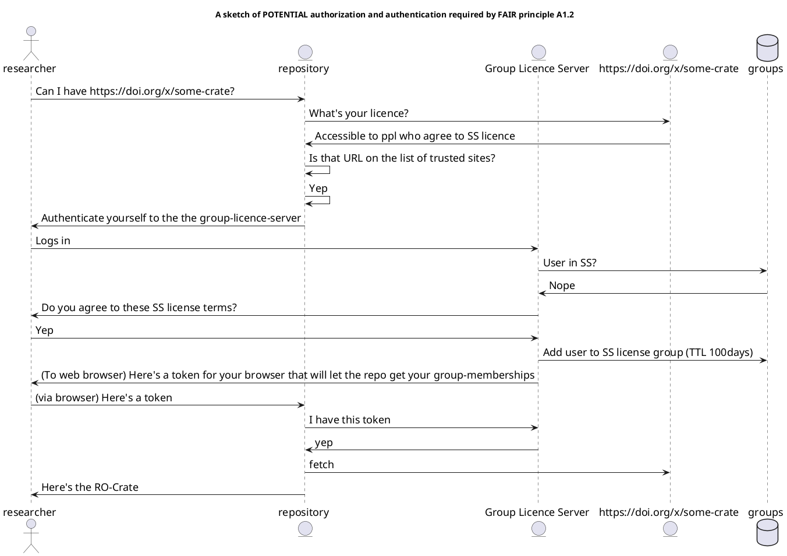


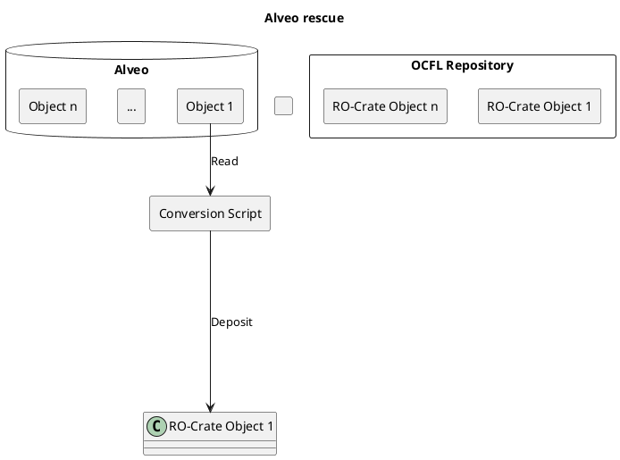

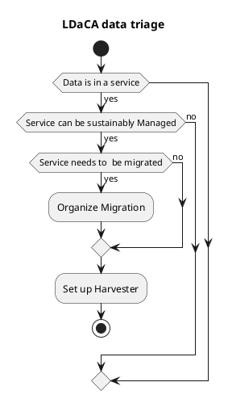
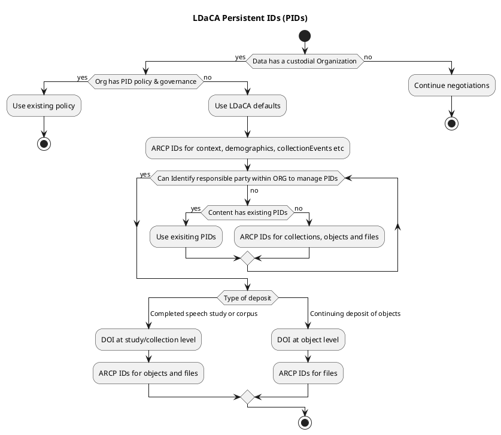
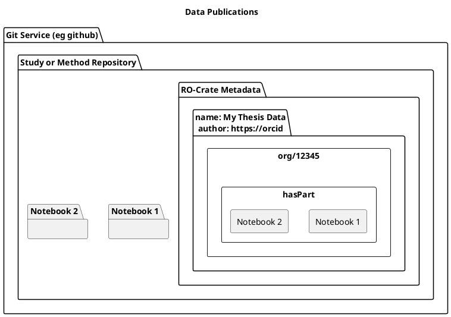

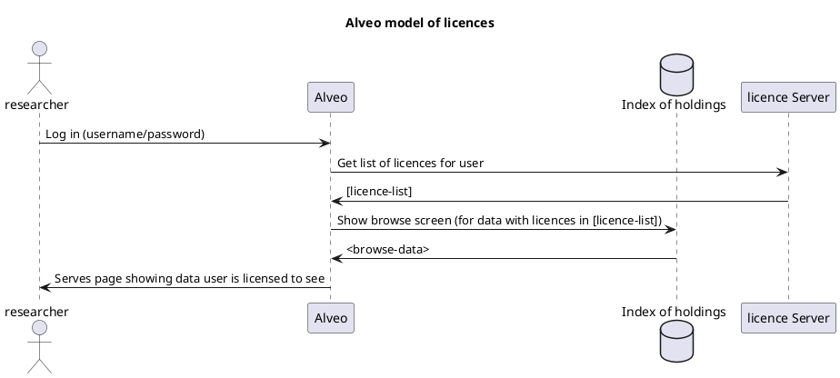
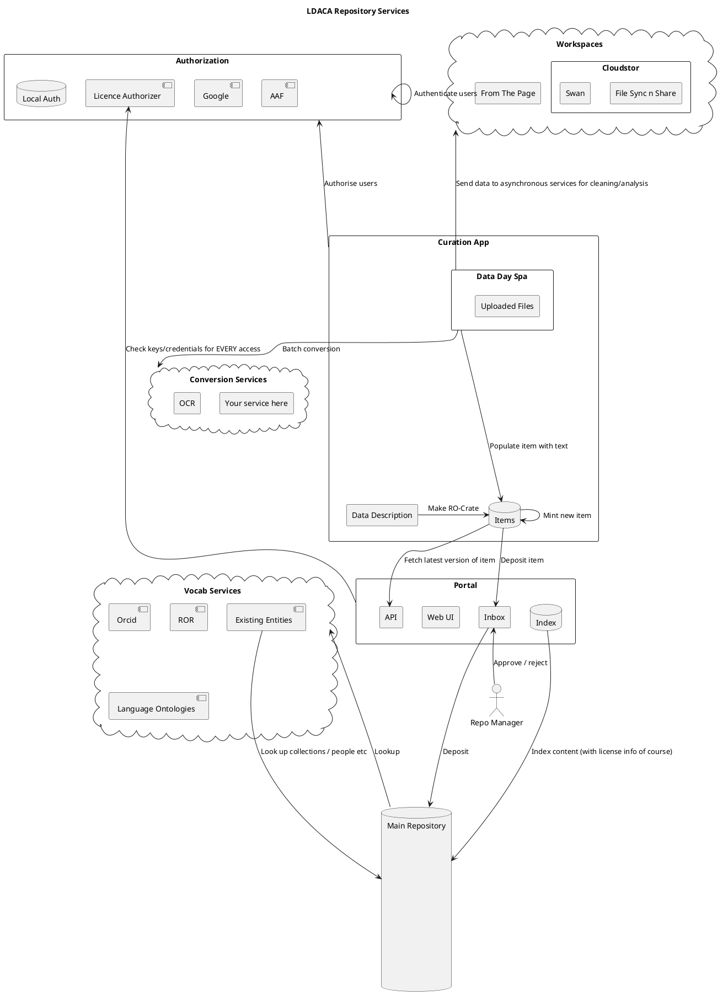
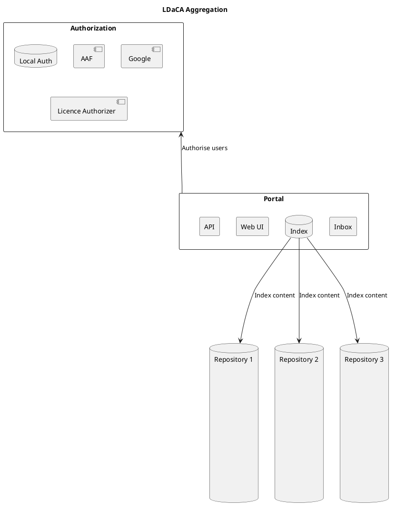

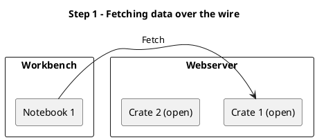
```plantuml:ldaca-step-2
@startuml
Title: Step 2 - Adding scalability
rectangle Workbench {
rectangle "Notebook 1" as w1 {
}
}


rectangle Webserver {
rectangle "Simple OCFL front end" as ui {

}

rectangle "OCFL Repo" as ocfl {


rectangle "Crate 1 (open)" as c1 {
}
rectangle "Crate 2 (open)" as c2 {
}
}


}

w1 -> ui : Fetch Crate 1
ui <-> ocfl : Fetch Crate 1
ui --> c1 : Fetch
@enduml
```

```plantuml:ldaca-step-3
@startuml
Title: Step 3 - Adding discoverability
rectangle Workbench {
rectangle "Notebook 1" as w1 {
}
}

actor "Researcher 1" as r1


rectangle Webserver {
rectangle "OCFL search/discovery" as ui {

}

rectangle "OCFL Repo" as ocfl {


rectangle "Crate 1*" as c1 {
}
rectangle "Crate 2*" as c2 {
}
rectangle "Notebook 1*" as n1 {
}
rectangle "Notebook 2*" as n2 {
}
}

rectangle "Search results" as sr

note bottom of ocfl: "*" = Open licence

}

w1 -> ui : Fetch Crate 1
ui <-> ocfl : Fetch Crate 1
ui --> c1 : Fetch
r1 -> ui : Show me notebooks for wordcloud
ui -> sr : Show wordcloud notebooks

r1 -> sr : Invoke Notebook 1
sr -> Workbench : "Fire up Notebook 1 for Researcher 1
@enduml

@startuml
Title: Step 4 - Deposit
rectangle Workbench {
rectangle "Notebook 1" as w1 {
}
}

actor "Researcher 1" as r1

actor "Researcher 2" as r2

rectangle Webserver {
rectangle "OCFL search/discovery" as ui {

}

rectangle "OCFL Repo" as ocfl {


rectangle "Crate 1*" as c1 {
}
rectangle "Crate 2*" as c2 {
}
rectangle "Notebook 1*" as n1 {
}
rectangle "Notebook 2*" as n2 {
}

rectangle "My Wordcloud Notebook" as mwn {
}
}


note bottom of ocfl: "*" = Open licence

}

rectangle "Licence Authorizer" as auth {

}

r1 -down-> w1: Save as My wordcloud notebook
Workbench -down-> ocfl : Deposit *My Wordcloud Notebook* with single-user license
mwn -up-> w1 : Provenance -- derived from

r2 -> ui : Fire up My Word Cloud Notebook

ui ---> auth : Is r2 allowed to see mwn
auth -> ui : No
ui ----> r2 : NO!
@enduml
```
```plantuml:ldaca-step-3-1
@startuml

actor "Speaker 1" as s1
actor "Speaker 2" as s2

rectangle "RO-Crate Profile (this document)" {
rectangle "#Collection" as procoll
rectangle "#Object" as proobj
}

rectangle "Conversation" as c1 {

 
 rectangle "@type: [RepositoryObject]" 

}
rectangle "Audio File" as audio1 {
   rectangle "@id: [file.wav]\n@type: [File, PrimaryText]\nmodality: [Speech]\ncommunicationGenre: [Interview]\nresourceType: [PrimaryText]\nencodingFormat: [audio/x-wav]" 


}
rectangle "PDF File" as pdf1 {
   rectangle "@id: [file.pdf]\n@type: [File, Annotation]\nannotationType: [Transcription]\nmodality: [Orthography]\nresourceType: [DerivedText]\nencodingFormat: [text/pdf]" as pt 

}

rectangle "CSV File" as csv1 {
   rectangle "@id: [file.csv]\n@type: [File, Annotation, DerivedText]\nannotationType: [Transcription]\nmodality: [Orthography]\nresourceType: [DerivedText]\nencodingFormat: [text/csv]" 
}

c1 -down-> pdf1 : hasPart

pdf1 -up-> audio1 : annotationOf
c1 -down-> audio1 : hasPart
c1 -down-> csv1 : hasPart
csv1 -up-> audio1 : annotationOf
csv1 -up-> pdf1 : derivedFrom

c1 -left-> s1 : interviewer
c1 -right-> s2 : interviewee
c1 ->  proobj: conformsTo


@enduml
```
```plantuml:ldaca-step-3-2
@startuml

rectangle "Work (Class: Dataset)" as w {

}

@enduml
```
```plantuml:ldaca-step-3-3
@startuml

rectangle "Work (Class: Dataset)" as w {

}

actor "Contributor (Class: Person)" as c

w -> c : compiler (Class: Property)

@enduml
```
```plantuml:ldaca-step-3-4
@startuml

rectangle "Work" as w {

}

actor "Contributor" as c

w -> c : compiler 
w -> c : depositor 


@enduml
```
```plantuml:ldaca-step-3-5
@startuml

rectangle "Work" as w {

}

actor "Contributor " as c

w -> c : hasCompiler 
w <- c : compilerOf 


@enduml
```
```plantuml:ldaca-step-3-6
@startuml

rectangle "Work" as w {

}

actor "Contributor 1" as c1
actor "Contributor 2 " as c2

rectangle "CreateActionSpeak" as a1 {
   [date: 2022-01-02]
}

rectangle "UpdateActionDeposit" as a2 {
   [date: 2022-02-02]
}


rectangle "CreateActionRecord" as a3 {
   [date: 2022-02-02] as di
}

rectangle "Video Camera" as cam {

}
a1 -down-> w : result
a1 -up-> c1 : agent

a2 -down-> w : result
a2 -up-> c2 : agent

a3 -down-> w : result
a3 -up-> c2 : agent
a3 -down-> cam : instrument


@enduml
```