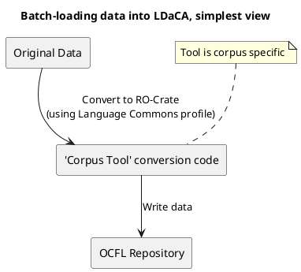
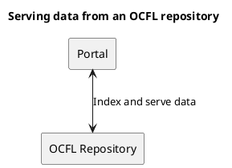
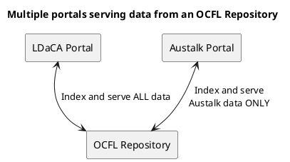
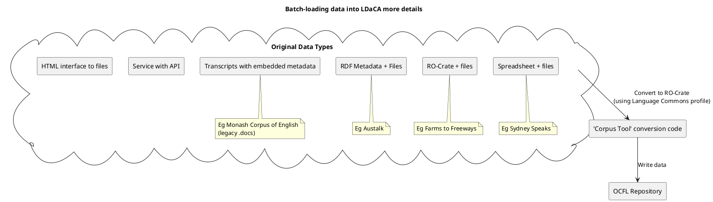

# Diagrams to explain how we on-board data at LDaCA

```plantuml:ldaca-batch-data-conversion-simple
@startuml
title: Batch-loading data into LDaCA, simplest view

rectangle "Original Data" as data {

}

rectangle "'Corpus Tool' conversion code" as ct {

}

note top of ct : Tool is corpus specific

rectangle "OCFL Repository" as repo {

}

ct <-up- data : Convert to RO-Crate\n(using Language Commons profile)
ct -down-> repo : Write data 

@enduml
```

Data from the repository are then made available via a portal

```plantuml:ldaca-portal
@startuml
title: Serving data from an OCFL repository

rectangle "Portal" as portal {

}

rectangle "OCFL Repository" as repo {

}

portal <-down-> repo : Index and serve data 

@enduml
```

```plantuml:ldaca-portal-multiple
@startuml
title: Multiple portals serving data from an OCFL Repository

rectangle "LDaCA Portal" as portal {

}

rectangle "Austalk Portal" as aportal {

}

rectangle "OCFL Repository" as repo {

}

portal <-down-> repo : Index and serve ALL data 
aportal <-down-> repo : Index and serve\nAustalk data ONLY 
@enduml
```

```plantuml:ldaca-batch-data-conversion-simple
@startuml
title: Batch-loading data into LDaCA more details

cloud "Original Data Types" as data {
rectangle "Spreadsheet + files" as csv {

}
note bottom of csv: Eg Sydney Speaks
rectangle "RO-Crate + files" as crate {
    
}

note bottom of crate: Eg Farms to Freeways

rectangle "RDF Metadata + Files" as rdf {
    
}

note bottom of rdf: Eg Austalk
rectangle "Transcripts with embedded metadata" as word {
    
}

note bottom of word : Eg Monash Corpus of English\n(legacy .docs)


rectangle "Service with API" {
    
}

rectangle "HTML interface to files" {
    
}

}

rectangle "'Corpus Tool' conversion code" as ct {

}

rectangle "OCFL Repository" as repo {

}

ct <-up- data : Convert to RO-Crate\n(using Language Commons profile)
ct -down-> repo : Write data 

@enduml
```

