# Diagrams to explain how we on-board data at LDaCA

```plantuml:ldaca-batch-data-conversion-simple
@startuml
title: Batch-loading data into LDaCA, simplest view

rectangle "📈📄📜  Original Data 🎥🎙" as data {

}

rectangle "⚙️ 'Corpus Tool' conversion code ⚙️ " as ct {

}

note top of ct : Tool is corpus specific

database "Arkisto Repository" as repo {

}

ct <-up- data : Convert to RO-Crate\n(using Language Commons profile)
ct -down-> repo : Write data 

@enduml
```



Data from the repository are then made available via a portal

```plantuml:ldaca-portal-multiple
@startuml
title: Multiple portals serving data from an OCFL Repository

rectangle "💡 LDaCA Portal 💡" as portal {

}

rectangle "💡 Austalk Portal 💡" as aportal {

}

database "Arkisto Repository" as repo {

}

portal <-down-> repo : Index and serve ALL data 
aportal <-down-> repo : Index and serve\nAustalk data ONLY 
@enduml
```





```plantuml: ldaca_developing_corpus_tool

@startuml
title: Corpus Tool Development process

start

:Identify Metadata Source;

label lab
:Create/update Tool w/ Metadata Crosswalk;

:Run tool  to create repo;

:Index repo into test portal;

if (It Looks Right) then (no)
 :Rinse, repeat;
 goto lab

else (yes)
 stop

@enduml
