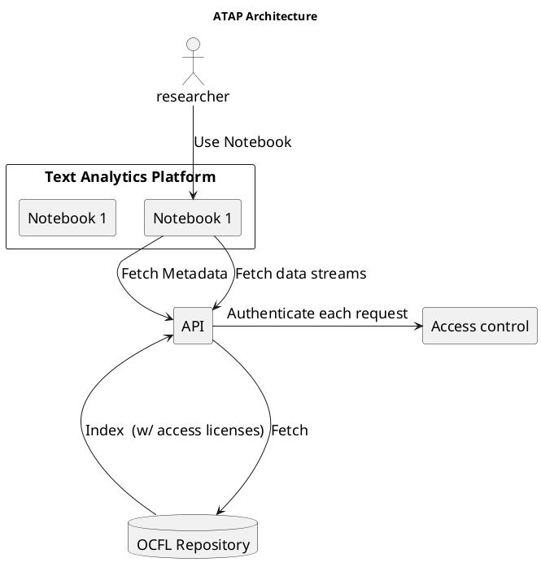
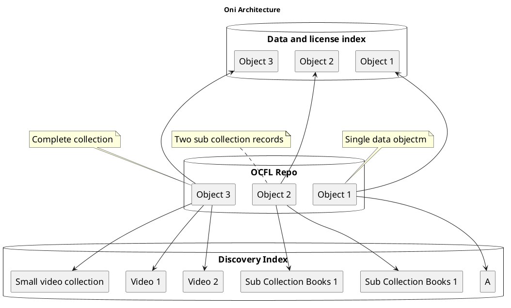
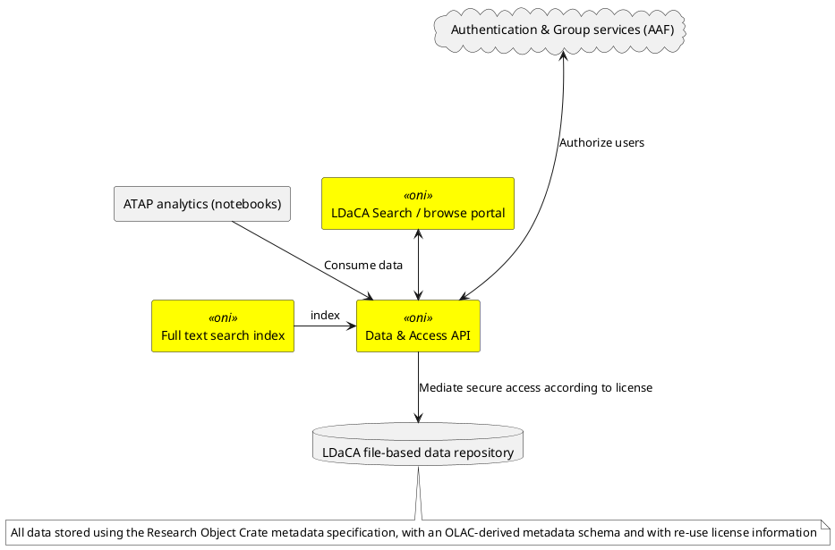
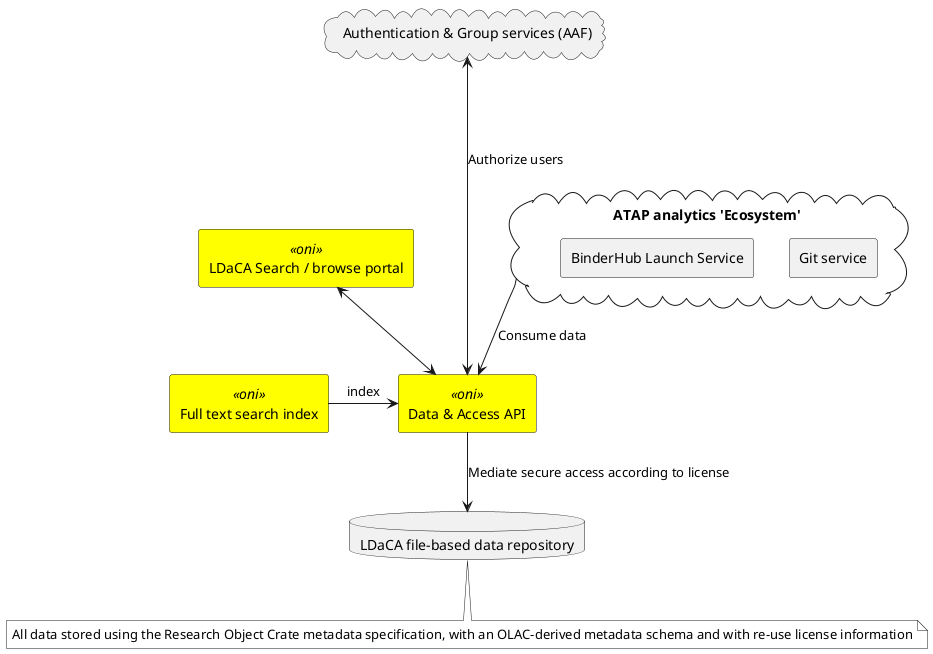
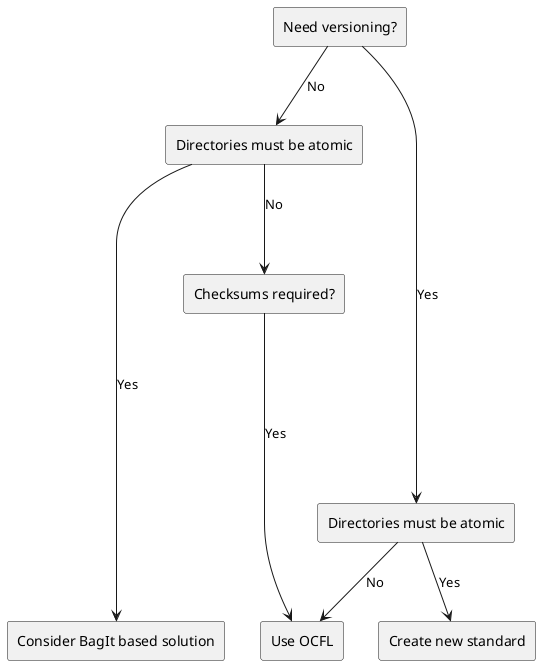

```plantuml:oni-atap-architecture
@startuml
skinparam defaultFontSize 18
title: ATAP Architecture

rectangle "Text Analytics Platform" as atap {
rectangle "Notebook 1" as n1 {

}

rectangle "Notebook 1" as n2 {
    
}
}
database "OCFL Repository" as repo {


}

rectangle "API" as oni {

}

rectangle "Access control" as ac {

}


actor researcher

researcher -down-> n1 : Use Notebook
n1 -down-> oni : Fetch Metadata 
n1 -down-> oni : Fetch data streams
oni -> ac : Authenticate each request
oni <--down-- repo : Index  (w/ access licenses)
oni -down-> repo : Fetch
@enduml
```

```plantuml:oni-architecture
@startuml
skinparam defaultFontSize 18
title: Oni Architecture

database "Discovery Index" {
    rectangle "A" {

    }
        rectangle "Object, Diaglogue" as A {
        
    }
        rectangle "Sub Collection Books 1" as B {
        
    }
        rectangle "Sub Collection Books 1" as C {
        
    }
        rectangle "Small video collection"  as D{
        
    }
        rectangle "Video 1" as E {
        
    }
           rectangle "Video 2" as F {
        
    }

}

database "Data and license index" {
       rectangle "Object 1" as o1 {

    }
    rectangle "Object 2" as o2 {
        
    }
   rectangle "Object 3" as o3 {
        
    }

}


database "OCFL Repo" as repo {
    rectangle "Object 1" as ro1 {

    }
    rectangle "Object 2"  as ro2 {
        
    }
   rectangle "Object 3" as ro3 {
        
    }
}

note top of ro3: Complete collection
note top of ro2: Two sub collection records
note top of ro1: Single data objectm
ro1 ---> A
ro2 ---> B
ro2 ---> C
ro3 ---> D
ro3 ---> E
ro3 ---> F

ro1 --up--> o1
ro2 --up--> o2
ro3 --up--> o3


@enduml

@startuml

database "Index" {
rectangle "Data & License index" as ii {

}
rectangle "Discovery Index" as ai {

}
}

database ".......... OCFL Repo .............. \n\n\n\n\n\n\n\n\n\n\n\n" as repo {
    
}

rectangle "Indexer" {

}

rectangle "Config" as conf {

}

Indexer -up-> repo : Scan objects
Indexer -> conf : Consume
Indexer -up-> Index : Write

rectangle "API" {
    [item/] as iapi
    [query/] as qapi
    [license filter] as lic

}

cloud "Authentication and Authorizatio Services" as auth {
    [CILogon]
    [Mukurtu]
    [...]

}

rectangle "UI" {
  
}
lic -> auth : Get user's group/license holdings
UI --down--> qapi : Construct views
UI --down--> iapi : Get data for viewing
iapi --down-> ii : Consult for get requests\nfor Objects and files
qapi --down-> ai : Consult for queries / views\n*with license filter

API --down->  repo : Read

@enduml
```

```plantuml:oni-architecture-2
@startuml

skinparam rectanglebackgroundColor<<oni>> yellow
skinparam databasebackgroundColor<<oni>> yellow
skinparam noteBackgroundColor white


rectangle "ATAP analytics (notebooks)" as atap {

}

rectangle "LDaCA Search / browse portal" <<oni>> as oni {

}

rectangle "Full text search index" <<oni>> as elastic {

}

rectangle "Data & Access API" <<oni>> as api {

}

database "LDaCA file-based data repository"  as ocfl {

}

cloud "Authentication & Group services (AAF)" as auth {

}

atap -down-> api : Consume data
oni <-down-> api
auth <--down--> api : Authorize users
elastic -> api : index
api -down-> ocfl : Mediate secure access according to license

note bottom of ocfl : All data stored using the Research Object Crate metadata specification, with an OLAC-derived metadata schema and with re-use license information


@enduml
```

```plantuml:oni-architecture-3
@startuml

skinparam rectanglebackgroundColor<<oni>> yellow
skinparam databasebackgroundColor<<oni>> yellow
skinparam noteBackgroundColor white


cloud "ATAP analytics 'Ecosystem' " as atap {
    rectangle "Git service" {

    }
    rectangle "BinderHub Launch Service" {
        
    }
}

rectangle "LDaCA Search / browse portal" <<oni>> as oni {

}

rectangle "Full text search index" <<oni>> as elastic {

}

rectangle "Data & Access API" <<oni>> as api {

}

database "LDaCA file-based data repository"  as ocfl {

}

cloud "Authentication & Group services (AAF)" as auth {

}

atap -down-> api : Consume data
oni <-down-> api
auth <--down--> api : Authorize users
elastic -> api : index
api -down-> ocfl : Mediate secure access according to license

note bottom of ocfl : All data stored using the Research Object Crate metadata specification, with an OLAC-derived metadata schema and with re-use license information


@enduml
```

```plantuml:oni-architecture-4
@startuml

rectangle "Need versioning?" as nv {

}


rectangle "Directories must be atomic" as atomic  {

}

rectangle "Directories must be atomic" as atomic2  {

}

rectangle "Checksums required?" as cr {

}

rectangle "Use OCFL" as ocfl {

}
rectangle "Consider BagIt based solution" as bagit {

}

rectangle "Create new standard" as ns {

}

nv -down-> atomic : No
atomic ---down---> bagit : Yes
atomic -down-> cr : No
cr -down-> ocfl : Yes
nv ---down---> atomic2 : Yes
atomic2 -down-> ocfl : No
atomic2 -down-> ns : Yes
@enduml
```

