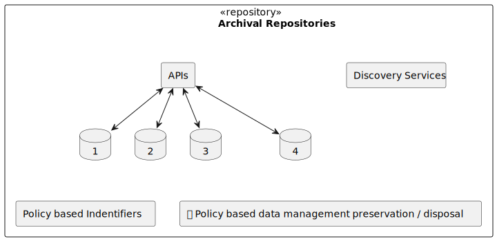
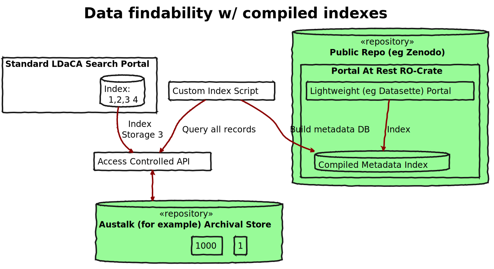
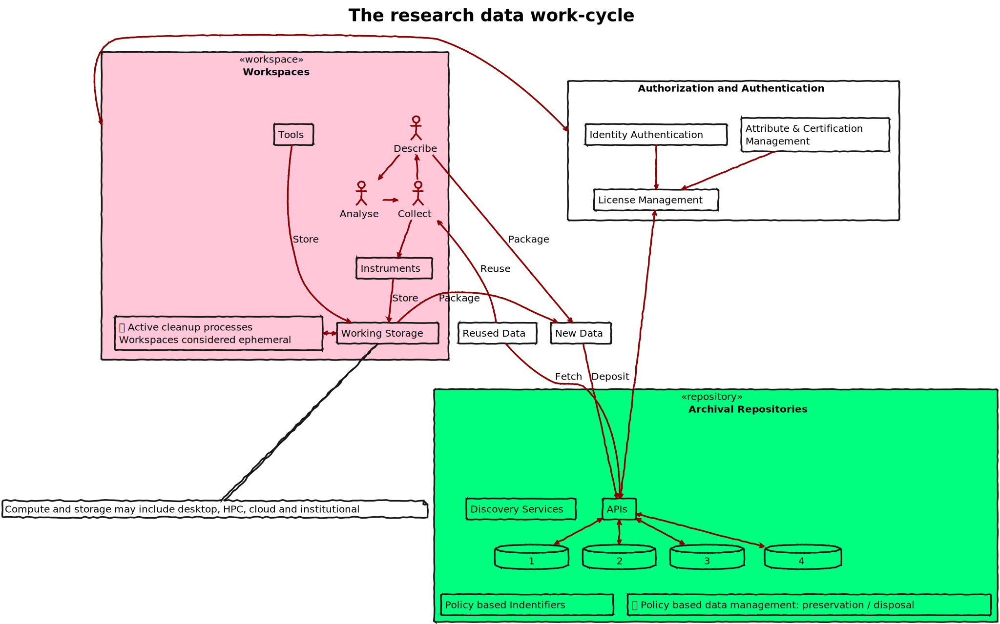
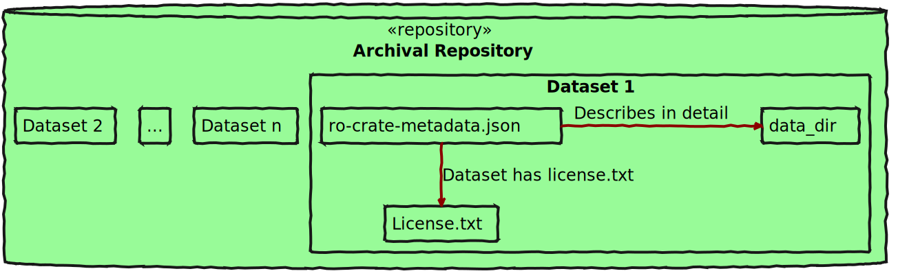

# Image summary for generic

## [generic/access-control.svg](./access-control.svg)

## [generic/antipattern-built-inauth.svg](./antipattern-built-inauth.svg)

## [generic/archive-components.svg](./archive-components.svg)

## [generic/authorization-components.svg](./authorization-components.svg)

## [generic/disovery-storage-stack-packaged.svg](./disovery-storage-stack-packaged.svg)

## [generic/disovery-storage-stack.svg](./disovery-storage-stack.svg)

## [generic/fair-conceptual-architecture.svg](./fair-conceptual-architecture.svg)

## [generic/fair-data-cycle.svg](./fair-data-cycle.svg)

## [generic/ocfl-contains-ro-crate.svg](./ocfl-contains-ro-crate.svg)

## [generic/simple-distributed-access-control.svg](./simple-distributed-access-control.svg)

## [generic/simple-repo-object-structure.svg](./simple-repo-object-structure.svg)

## [generic/standards-components.svg](./standards-components.svg)

## [generic/storage-metadata-stack.svg](./storage-metadata-stack.svg)

