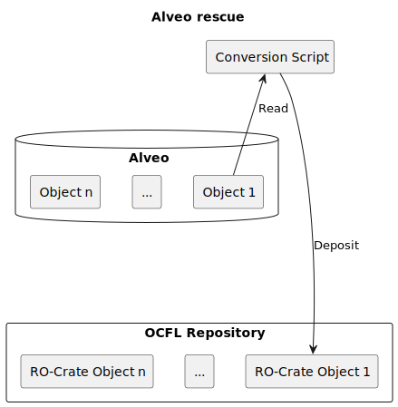
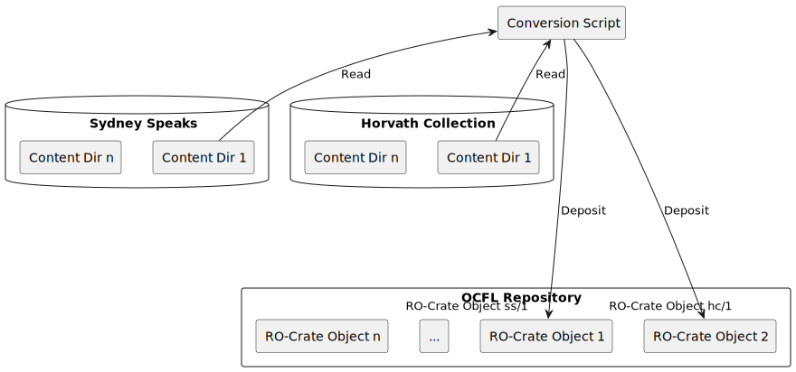
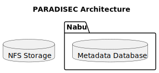
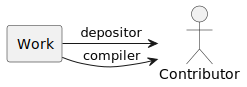
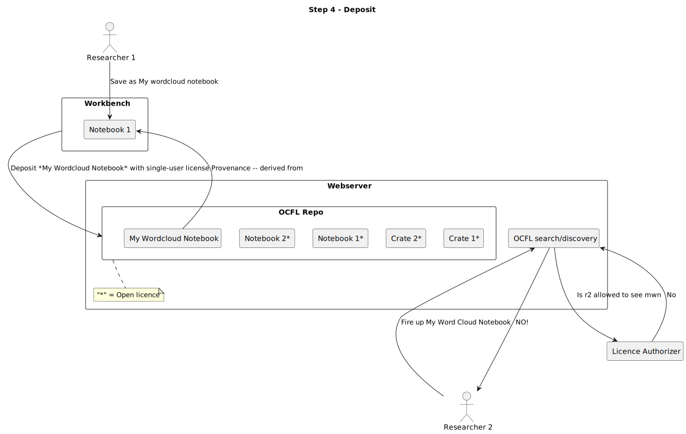

# Image summary for ldaca

## [ldaca/Alveo.svg](./Alveo.svg)

## [ldaca/data-triage.svg](./data-triage.svg)

## [ldaca/ldaca_ldaca-aggregation.svg](./ldaca_ldaca-aggregation.svg)

## [ldaca/ldaca_ldaca-alveo-rescue.svg](./ldaca_ldaca-alveo-rescue.svg)

## [ldaca/ldaca_ldaca-alveo.svg](./ldaca_ldaca-alveo.svg)

## [ldaca/ldaca_ldaca-data-publications.svg](./ldaca_ldaca-data-publications.svg)

## [ldaca/ldaca_ldaca-data-storage-options.svg](./ldaca_ldaca-data-storage-options.svg)

## [ldaca/ldaca_ldaca-paradisec-architecture.svg](./ldaca_ldaca-paradisec-architecture.svg)

## [ldaca/ldaca_ldaca-paradisec-workspaces.svg](./ldaca_ldaca-paradisec-workspaces.svg)

## [ldaca/ldaca_ldaca-persistent-ids.svg](./ldaca_ldaca-persistent-ids.svg)

## [ldaca/ldaca_ldaca-repository-services.svg](./ldaca_ldaca-repository-services.svg)

## [ldaca/ldaca_ldaca-ro-crate-profile-this-document.svg](./ldaca_ldaca-ro-crate-profile-this-document.svg)

## [ldaca/ldaca_ldaca-ro-crate-profile-this-document9.svg](./ldaca_ldaca-ro-crate-profile-this-document9.svg)

## [ldaca/ldaca_ldaca-ro-crate-profile-this-document9_001.svg](./ldaca_ldaca-ro-crate-profile-this-document9_001.svg)

## [ldaca/ldaca_ldaca-ro-crate-profile.svg](./ldaca_ldaca-ro-crate-profile.svg)

## [ldaca/ldaca_ldaca-self-contained-corpus.svg](./ldaca_ldaca-self-contained-corpus.svg)

## [ldaca/ldaca_ldaca-simple-repository-access.svg](./ldaca_ldaca-simple-repository-access.svg)

## [ldaca/ldaca_ldaca-sketch-potential-authorization.svg](./ldaca_ldaca-sketch-potential-authorization.svg)

## [ldaca/ldaca_ldaca-step-1.svg](./ldaca_ldaca-step-1.svg)

## [ldaca/ldaca_ldaca-step-2.svg](./ldaca_ldaca-step-2.svg)

## [ldaca/ldaca_ldaca-step-3-1.svg](./ldaca_ldaca-step-3-1.svg)

## [ldaca/ldaca_ldaca-step-3-2.svg](./ldaca_ldaca-step-3-2.svg)

## [ldaca/ldaca_ldaca-step-3-3.svg](./ldaca_ldaca-step-3-3.svg)

## [ldaca/ldaca_ldaca-step-3-4.svg](./ldaca_ldaca-step-3-4.svg)

## [ldaca/ldaca_ldaca-step-3-5.svg](./ldaca_ldaca-step-3-5.svg)

## [ldaca/ldaca_ldaca-step-3-6.svg](./ldaca_ldaca-step-3-6.svg)

## [ldaca/ldaca_ldaca-step-3.svg](./ldaca_ldaca-step-3.svg)

## [ldaca/ldaca_ldaca-step-3_001.svg](./ldaca_ldaca-step-3_001.svg)

## [ldaca/simple-authorization-interaction.svg](./simple-authorization-interaction.svg)

