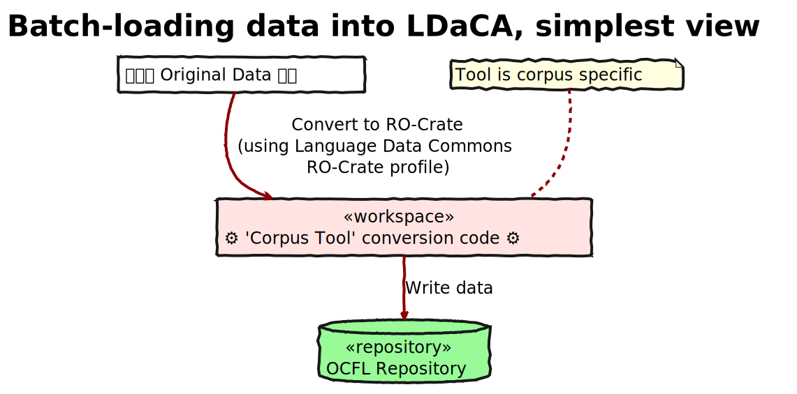
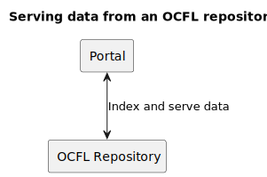

# Image summary for onboarding

## [onboarding/ldaca-batch-data-conversion.svg](./ldaca-batch-data-conversion.svg)

## [onboarding/ldaca-data-prep-wb-onboarding.svg](./ldaca-data-prep-wb-onboarding.svg)

## [onboarding/ldaca-data-prep-workbench-conversion.svg](./ldaca-data-prep-workbench-conversion.svg)

## [onboarding/ldaca_distributed-ro-crates_2.svg](./ldaca_distributed-ro-crates_2.svg)

## [onboarding/ldaca_onboarding_ldaca-batch-data-conversion-simple.svg](./ldaca_onboarding_ldaca-batch-data-conversion-simple.svg)

## [onboarding/ldaca_onboarding_ldaca-batch-data-conversion-simple3.svg](./ldaca_onboarding_ldaca-batch-data-conversion-simple3.svg)

## [onboarding/ldaca_onboarding_ldaca-portal-multiple.svg](./ldaca_onboarding_ldaca-portal-multiple.svg)

## [onboarding/ldaca_onboarding_ldaca-portal.svg](./ldaca_onboarding_ldaca-portal.svg)

## [onboarding/ldaca_self-containing-ro-crate.svg](./ldaca_self-containing-ro-crate.svg)

## [onboarding/ocs_model.svg](./ocs_model.svg)

## [onboarding/ro-crate-basics.svg](./ro-crate-basics.svg)

