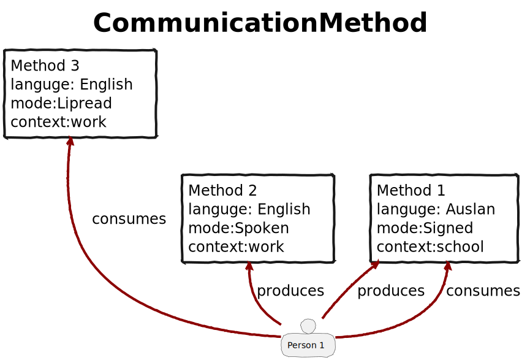
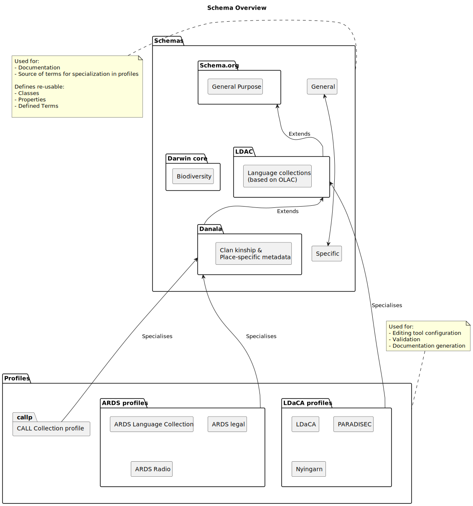
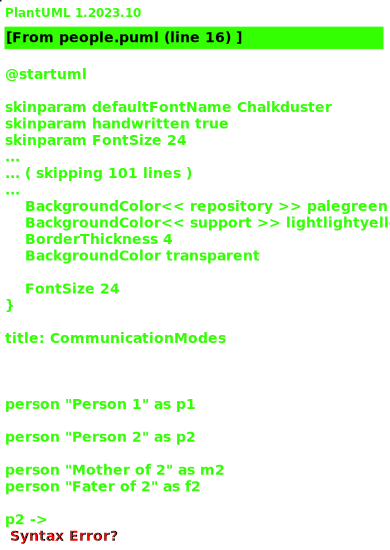
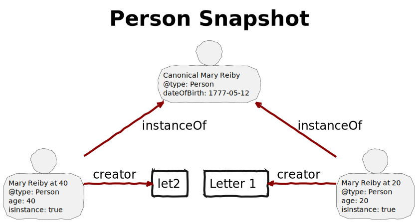
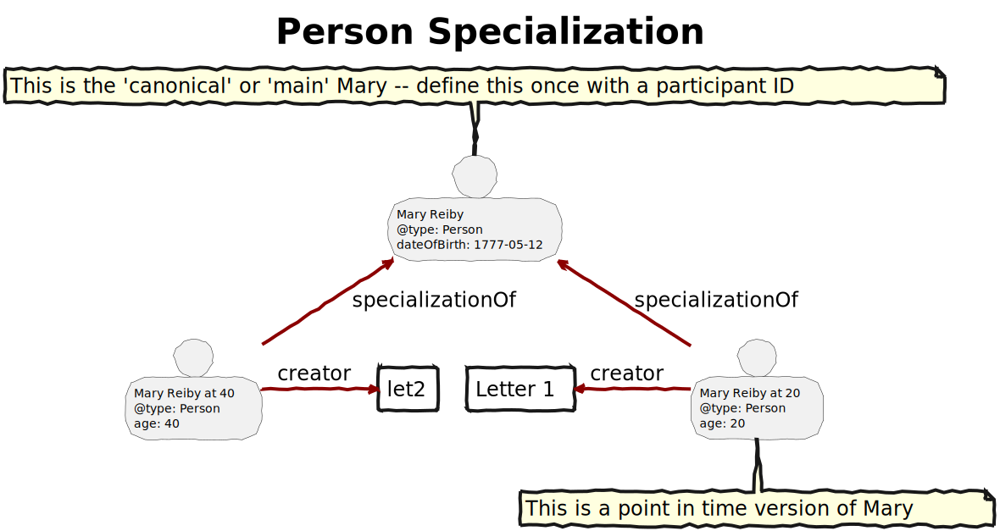
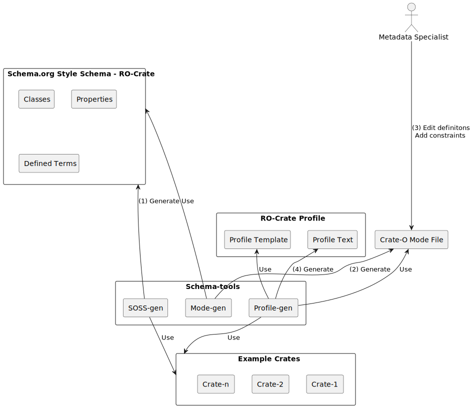

# Image summary for schemas

## [schemas/communication-mode.svg](./communication-mode.svg)

## [schemas/overview-schema-profile.svg](./overview-schema-profile.svg)

## [schemas/people.svg](./people.svg)

## [schemas/person-snapshot.svg](./person-snapshot.svg)

## [schemas/person-specialization.svg](./person-specialization.svg)

## [schemas/schemas_and_modes.svg](./schemas_and_modes.svg)

